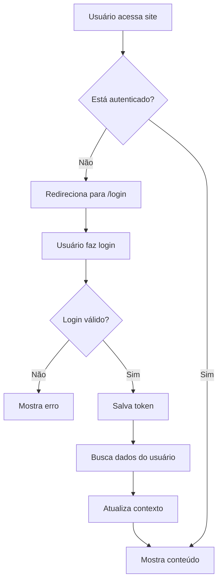

# 🔌 Guia de Integração - Frontend com API

## ✅ Sistema Implementado

Este frontend Next.js foi integrado com a API FastAPI do backend, incluindo:

- **Sistema completo de autenticação** (Login/Registro)
- **Gerenciamento de estado** com React Context
- **Proteção de rotas** automática
- **Interface moderna** com Ant Design
- **Comunicação com API** totalmente configurada

---

## 🚀 Como Executar

### 1. **Pré-requisitos**

- Node.js 18+ instalado
- Backend API rodando em `http://localhost:8000`

### 2. **Instalação**

```bash
cd tcc-frontend
npm install
```

### 3. **Configuração**

Crie um arquivo `.env.local` na raiz do projeto:

```env
NEXT_PUBLIC_API_URL=http://localhost:8000
```

### 4. **Iniciar Aplicação**

```bash
npm run dev
```

A aplicação estará disponível em `http://localhost:3000`

---

## 📁 Estrutura do Projeto

```
src/
├── app/
│   ├── login/              # Página de login
│   ├── register/           # Página de cadastro
│   └── layout.js           # Layout principal com AuthProvider
├── components/
│   ├── AppHeader.js        # Cabeçalho com menu de usuário
│   ├── AppLayout.js        # Layout condicional (com/sem menu)
│   ├── AppSideMenu.js      # Menu lateral
│   └── ProtectedRoute.js   # Componente de proteção de rotas
├── contexts/
│   └── AuthContext.js      # Contexto de autenticação
└── services/
    └── api.js              # Serviço de comunicação com API
```

---

## 🔐 Sistema de Autenticação

### **Como Funciona**

1. **Login/Registro**: Usuário acessa `/login` ou `/register`
2. **Token JWT**: Ao fazer login, recebe um token que é armazenado no `localStorage`
3. **Verificação Automática**: O `AuthContext` verifica se há token e busca dados do usuário
4. **Proteção de Rotas**: O `ProtectedRoute` redireciona para login se não autenticado
5. **Header Dinâmico**: Mostra informações do usuário e botão de logout

### **AuthContext - Métodos Disponíveis**

```javascript
import { useAuth } from '@/contexts/AuthContext';

function MyComponent() {
  const { 
    user,            // Dados do usuário atual
    loading,         // Estado de carregamento
    isAuthenticated, // Se está autenticado
    login,           // Função de login
    register,        // Função de registro
    logout,          // Função de logout
    updateUser       // Atualizar dados do usuário
  } = useAuth();
  
  // Seu código aqui
}
```

### **Exemplo de Login**

```javascript
const result = await login('usuario@email.com', 'senha123');

if (result.success) {
  // Login bem-sucedido
  router.push('/');
} else {
  // Erro no login
  console.error(result.error);
}
```

### **Exemplo de Registro**

```javascript
const userData = {
  name: 'João Silva',
  email: 'joao@email.com',
  password: 'senha123',
  cpf: '123.456.789-00',
  phone: '(11) 99999-9999',
  is_producer: true,
  is_technical: false,
  is_admin: false
};

const result = await register(userData);

if (result.success) {
  // Cadastro bem-sucedido (faz login automático)
  router.push('/');
}
```

---

## 📡 Serviço de API

O arquivo `src/services/api.js` contém todas as funções para comunicação com o backend.

### **Exemplos de Uso**

```javascript
import * as api from '@/services/api';

// ====== Autenticação ======
const token = await api.login('email@example.com', 'senha');
const user = await api.getCurrentUser();
await api.updateCurrentUser({ name: 'Novo Nome' });
await api.changePassword('senhaAntiga', 'senhaNova');

// ====== Animais ======
const animals = await api.getAnimals();
const animal = await api.getAnimal('animal_id');
await api.createAnimal({ name: 'Boi 001', ... });
await api.updateAnimal('animal_id', { name: 'Novo Nome' });
await api.deleteAnimal('animal_id');

// ====== Lotes ======
const batches = await api.getBatches();
const batch = await api.getBatch('batch_id');
await api.createBatch({ name: 'Lote A', ... });

// ====== Propriedades ======
const properties = await api.getProperties();
await api.createProperty({ name: 'Fazenda', ... });

// ====== Medicamentos ======
const medicines = await api.getMedicines();
await api.createMedicine({ name: 'Ivermectina', ... });

// ====== E mais... ======
// Veja src/services/api.js para todas as funções disponíveis
```

### **Tratamento de Erros**

```javascript
try {
  const animals = await api.getAnimals();
  console.log('Animais:', animals);
} catch (error) {
  console.error('Erro ao buscar animais:', error.message);
  message.error('Erro ao buscar animais');
}
```

---

## 🎨 Páginas de Login e Registro

### **Características**

- ✅ Design moderno com gradiente
- ✅ Validação de formulários em tempo real
- ✅ Mensagens de erro claras
- ✅ Loading states
- ✅ Máscara de CPF e telefone
- ✅ Seleção de tipo de usuário
- ✅ Campo condicional (número do conselho para técnicos)

### **Tipos de Usuário**

- **Produtor**: Pode gerenciar propriedades e animais
- **Técnico**: Pode registrar eventos e consultar dados (requer número do conselho)
- **Gerente de Cooperativa**: Acesso a múltiplas propriedades
- **Governo**: Acesso para fiscalização

---

## 🛡️ Proteção de Rotas

### **Rotas Públicas** (não requerem autenticação)

- `/login`
- `/register`
- `/forgot-password`

### **Rotas Protegidas** (requerem autenticação)

Todas as outras rotas exigem que o usuário esteja logado. Se não estiver, será redirecionado para `/login`.

### **Como Funciona**

O componente `ProtectedRoute` em `AppLayout`:

1. Verifica se o usuário está autenticado
2. Se não estiver e tentar acessar rota protegida → redireciona para `/login`
3. Se estiver autenticado e tentar acessar `/login` ou `/register` → redireciona para `/`
4. Mostra loading enquanto verifica autenticação

---

## 🔧 Personalizações

### **Alterar URL da API**

Edite `.env.local`:

```env
NEXT_PUBLIC_API_URL=https://sua-api.com
```

### **Adicionar Nova Rota da API**

1. Adicione a função em `src/services/api.js`:

```javascript
export async function getNewResource() {
  return apiRequest('/new-resource/');
}
```

2. Use em qualquer componente:

```javascript
import { getNewResource } from '@/services/api';

const data = await getNewResource();
```

### **Adicionar Nova Página Protegida**

Crie a página normalmente em `src/app/`, a proteção será automática!

### **Adicionar Nova Página Pública**

1. Crie a página
2. Adicione a rota em `src/components/ProtectedRoute.js`:

```javascript
const publicPages = ['/login', '/register', '/forgot-password', '/sua-nova-pagina'];
```

---

## 📱 Componentes Principais

### **AppHeader** - Cabeçalho

Mostra:
- Logo do sistema
- Nome do usuário
- Tipo de usuário (badge colorido)
- Menu dropdown com perfil, configurações e logout

### **AppSideMenu** - Menu Lateral

Menu de navegação com todas as seções do sistema.

### **AppLayout** - Layout Condicional

Decide se mostra layout completo (com header e menu) ou apenas o conteúdo (para login/registro).

---

## 🎯 Fluxo de Autenticação



---

## ✨ Próximos Passos

Agora que a autenticação está funcionando, você pode:

1. **Integrar as páginas existentes** com a API
2. **Adicionar validação de permissões** (por tipo de usuário)
3. **Criar página de perfil** do usuário
4. **Implementar "Esqueci minha senha"**
5. **Adicionar refresh token** para melhor segurança

---

## 🐛 Troubleshooting

### **Erro: "Failed to fetch"**

- Verifique se a API está rodando em `http://localhost:8000`
- Verifique se a URL no `.env.local` está correta
- Verifique CORS no backend

### **Usuário não aparece logado após refresh**

- Verifique se o token está sendo salvo no localStorage
- Verifique se o endpoint `/auth/me` está funcionando
- Abra o console e veja os erros

### **Redirecionamento infinito**

- Verifique se as rotas públicas estão corretas em `ProtectedRoute.js`
- Limpe o localStorage: `localStorage.clear()`

---

## 📚 Documentação Adicional

- [Next.js Documentation](https://nextjs.org/docs)
- [Ant Design Documentation](https://ant.design/components/overview/)
- [API Documentation](http://localhost:8000/docs)

---

## 🎉 Conclusão

O frontend está totalmente integrado com a API! Você agora tem:

✅ Sistema de login e cadastro funcional  
✅ Proteção de rotas automática  
✅ Gerenciamento de estado do usuário  
✅ Serviço de API completo  
✅ Interface moderna e responsiva  

Bom desenvolvimento! 🚀

